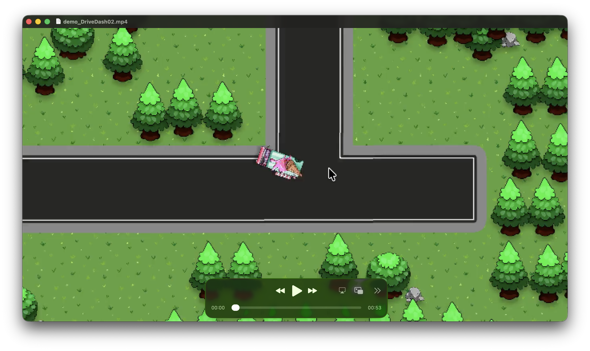
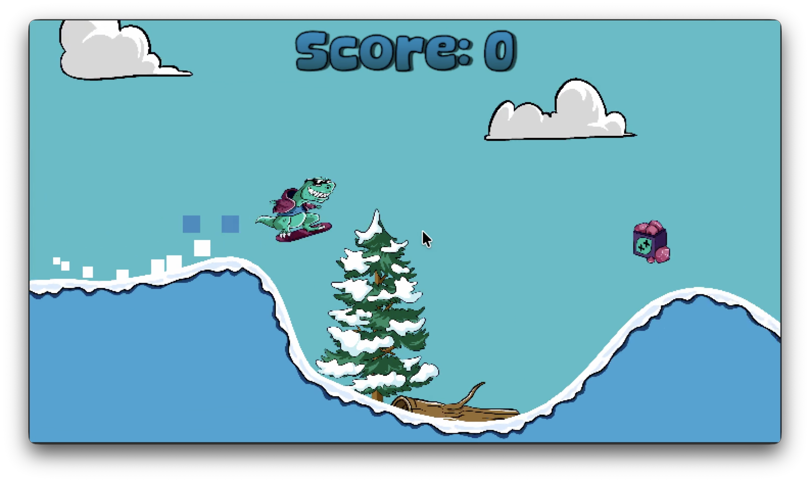

# Unity Learning Projects

This repository contains a collection of small Unity projects created as part of my hands-on exploration of game development.

My primary goal was to learn Unity by building actual games rather than following isolated examples. Each project focuses on different aspects of gameplay programming, physics, animation, audio, level design, camera systems, and player interactions.

The repository also serves as a portfolio demonstrating my approach to learning new technologies and applying software engineering experience to game development.

> based on courses from:
> 
 - Udemy ([Complete C# Unity 2D Game Development](https://www.udemy.com/course/unitycourse/?utm_campaign=Search_Keyword_Gamma_Prof_la.JA_cc.ROW-Japanese))

## Projects

### Car Dash

A simple top-down 2D driving game where the player controls a car, avoids obstacles, and collects pickups.

#### Features

- Top-down vehicle movement
- Collision handling
- Collectible items
- Score tracking
- Basic game loop

## Car Dash

A simple top-down 2D driving game where the player controls a car, avoids obstacles, and collects pickups.

  

  Click the image to open the demo video.

---

### Snow Surfer

A 2D side-scrolling runner game focused on movement, timing, and obstacle avoidance.

#### Features

- Side-scrolling gameplay
- Character movement and jumping
- Obstacle interaction
- Endless-runner style mechanics
- Simple animation system

## Snow Surfer

A 2D side-scrolling runner game focused on movement, timing, and obstacle avoidance.

  

  Click the image to open the demo video.

---

### TileMaster

A larger 2D platformer built using Unity's tilemap system.

#### Features

- Multiple levels
- Tilemap-based world design
- Enemy interactions
- Coin collection system
- Checkpoints and respawn
- Audio management
- Camera management
- Character animations
- Scene transitions

## TileMaster

A 2D platformer built using Unity's tilemap system.

  

  Click the image to open the demo video.

---

## Technologies

- Unity
- C#
- Unity Input System
- Tilemaps
- Cinemachine
- Unity Animation System
- Unity Physics 2D
- Unity Audio System

## Motivation

As a software engineer, I believe the best way to learn a technology is by building real projects.

These games were created to:

- Gain practical Unity experience
- Explore gameplay programming patterns
- Learn game-specific architecture and workflows
- Experiment with animation, audio, and camera systems
- Build a foundation for more advanced game development projects

## Portfolio Purpose

This repository is intended to demonstrate:

- Ability to learn unfamiliar technologies quickly
- Practical problem-solving skills
- Understanding of gameplay systems
- Clean and maintainable C# code
- Interest in professional game development

Feedback, suggestions, and opportunities are always welcome.